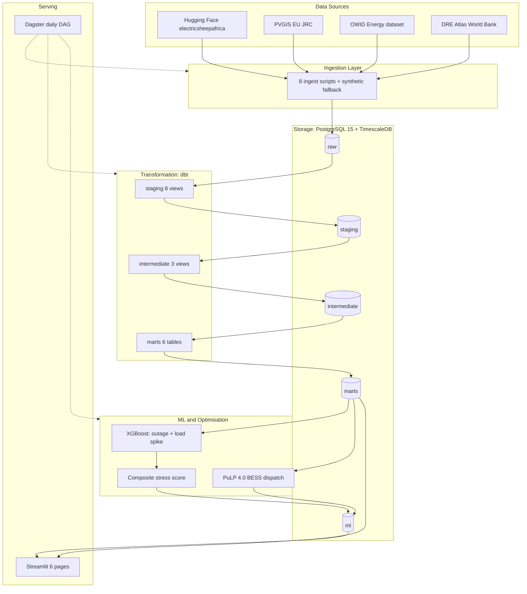

# Nigeria Grid & Mini-Grid Intelligence Platform

An end-to-end data platform that ingests Nigerian grid, demand, outage, solar, and settlement data, then applies machine learning and linear optimisation to predict grid instability, optimise battery dispatch, and score settlements for solar mini-grid deployment.

[](https://www.python.org/downloads/)
[](https://www.timescale.com/)
[](https://www.getdbt.com/)
[](https://dagster.io/)
[](https://www.docker.com/)

---

## The Problem

Nigeria's energy crisis is often described as a generation problem. The numbers suggest it is a management intelligence problem.

- Installed capacity exceeds 13,000 MW, but delivered supply often sits near 4,000 MW.
- The national grid collapsed twice in four days in January 2026, with generation dropping from 3,825 MW to 39 MW within minutes.
- GenCos were owed N6.8 trillion as of early 2026, growing by roughly N200 billion per month.
- Over 1,000 operational mini-grids exist across the country, most with battery storage, but there is no coordination layer between generation, storage, demand, and grid stability.
- Households spend roughly N540,000 per year on generator fuel.
- The Federal Government targets 137 GW of battery storage by 2060 under the Energy Transition Plan.

Nigeria has generation assets, storage potential, and capital. What it does not have is an intelligence layer that coordinates them. This project is a working prototype of that layer.

---

## What the Platform Does

| Layer | Capability |
|---|---|
| Ingests | 8 real data sources, 944,481 records covering grid, demand, telemetry, outages, solar, and settlements |
| Transforms | 16 dbt models (8 staging, 3 intermediate, 6 marts), 27 tests passing |
| Predicts | 2 XGBoost models plus a composite 0 to 100 grid stress score across 23 substations |
| Optimises | PuLP 4.0 linear programming for BESS dispatch across 3 regions and 4 deployment modes |
| Scores | 154,319 Nigerian settlements for solar mini-grid viability; 30,913 classified as deployment-ready |
| Serves | 6-page Streamlit dashboard and Dagster orchestration, running in Docker Compose |

---

## Architecture



---

## Key Findings

### Grid Stability

- Real Nigerian grid data shows outages in 26% of hours, consistent with the instability narrative.
- Severe outages affecting more than 1,000 customers occur in 3.5% of hours.
- The composite stress score successfully flags substations under sustained load pressure.

### Battery Economics

- Full mix (grid + diesel + battery) saves 1.3% to 6.2% of daily operating cost depending on the region.
- Solar charging delivers 2 to 3 times the savings of grid charging at the same diesel price.
- Battery-only, battery-grid-only, and battery-diesel-only configurations are either physically or economically infeasible. Batteries pay off only when grid and diesel coexist as complementary sources.

### Solar Mini-Grid Viability

- 30,913 settlements (A and B tiers) are deployment-ready, covering roughly 35 million residents.
- Kano leads with 4,668 viable sites, followed by Katsina at 4,437 and Kaduna at 2,832.
- Total national need is approximately 15,000 MW of solar and 60,000 MWh of storage to serve all A and B tier settlements.
- Solar charging delivers roughly 5 times the CO2 reduction of grid charging.

### Commercial Viability

- Diesel cost rose 86% year on year from 2025 to 2026 according to NBS data.
- Solar LCOE held steady at N90 to N120 per kWh in naira terms for the C&I segment.
- Battery IRR potential sits at 16% to 22% at current market prices.
- The renewable case strengthens each year as diesel prices rise faster than solar costs.

---

## Data Sources and Reliability Strategy

| Source | Rows | Type | Fallback |
|---|---|---|---|
| HF nigerian_energy_and_utilities_grid_load | 200,000 | Real HF snapshot | synthetic |
| HF nigerian_energy_and_utilities_demand_forecasting | 200,000 | Real HF snapshot | synthetic |
| HF nigerian_energy_and_utilities_smart_grid_iot | 250,000 | Real HF snapshot | synthetic |
| HF nigerian_energy_and_utilities_outage_fault_logs | 60,000 | Real HF snapshot | synthetic |
| HF nigerian_energy_and_utilities_ai_grid_optimization | 80,000 | Real HF snapshot | synthetic |
| PVGIS (EU JRC) | 36 | Real API | synthetic |
| OWID energy dataset | 126 | Real CSV | synthetic |
| World Bank DRE Atlas | 154,319 | Real GeoParquet | synthetic |

Every ingester attempts its primary source first and falls back to synthetic generation on failure. This reflects the reality of Nigerian energy data infrastructure, where public sources are unstable, PDF-heavy, and occasionally disappear. During this build:

- Hugging Face dataset IDs required correction. The original names returned 401 Unauthorized; the actual IDs use underscores, not hyphens.
- PVGIS failed transiently on 2 of 3 cities due to DNS cold-start, resolved with a three-attempt retry.
- DRE Atlas was blocked at energydata.info (403 for programmatic clients). The real data was located on source.coop, the World Bank CDN.
- Every failure was logged, and the pipeline never blocked.

---

## Tech Stack

| Category | Tools |
|---|---|
| Language | Python 3.12, SQL, Bash |
| Orchestration | Dagster 1.13 |
| Transformation | dbt-core 1.11 with dbt-postgres |
| Storage | PostgreSQL 15 with TimescaleDB |
| ML | XGBoost, scikit-learn, pandas, numpy |
| Optimisation | PuLP 4.0 with the CBC solver |
| Visualisation | Streamlit, Plotly |
| Containerisation | Docker and Docker Compose |
| CI | GitHub Actions |

---

## Quick Start

```bash
git clone https://github.com/Joystyxx/nigeria-grid-intelligence.git
cd nigeria-grid-intelligence

cp .env.example .env

docker compose up --build -d

docker compose ps
```

Once running:

- Streamlit dashboard at http://localhost:8501
- Dagster orchestration at http://localhost:3000
- PostgreSQL at localhost:5432

### Local development

For faster iteration during development, run components directly in a virtual environment:

```bash
py -3.12 -m venv .venv
.venv\Scripts\activate          # Windows
# source .venv/bin/activate     # macOS/Linux

pip install -e ".[dev]"

docker compose up -d postgres

streamlit run app/Home.py
```

---

## Repository Structure

```
nigeria-grid-intelligence/
├── app/                          Streamlit dashboard
│   ├── Home.py                   Landing page
│   └── pages/                    6 dashboard pages
├── config/
│   └── energy_prices.yaml        Nigerian energy prices, 2024 to 2026
├── dags/
│   └── grid_intelligence_dag.py  15-asset Dagster DAG
├── dbt/
│   ├── dbt_project.yml
│   ├── profiles.yml
│   └── models/
│       ├── staging/              8 models
│       ├── intermediate/         3 models
│       └── marts/                6 models
├── docs/
│   ├── architecture.md
│   ├── data_dictionary.md
│   ├── minigrid_viability_top50.geojson
│   ├── minigrid_viability_full.geojson
│   └── model_metrics*.json
├── scripts/                      Utility scripts
├── src/grid_intelligence/        Python package
│   ├── config.py
│   ├── db.py
│   ├── theme.py
│   ├── ingestion/                8 ingesters plus synthetic fallback
│   ├── ml/                       Features, training, prediction, stress scoring
│   └── optimization/             BESS dispatch, sensitivity, multi-year analysis
├── tests/                        pytest tests
├── docker-compose.yml
├── Dockerfile
├── pyproject.toml
└── README.md
```

---

## Deployment Modes (BESS)

| Mode | Components | Realistic Use Case | Status |
|---|---|---|---|
| full_mix | Grid + Diesel + Battery | Grid-tied substation with backup | Optimal |
| battery_grid | Grid + Battery | Pure grid-tied BESS | Infeasible |
| battery_diesel | Diesel + Battery | Off-grid mini-grid | Feasible, zero savings |
| battery_only | Battery only | Off-grid storage | Infeasible |

Only full_mix yields positive savings. This is itself a finding: the battery only adds value when grid and diesel coexist to arbitrage between them.

---

## Nomenclature

Two systems in this project use overlapping letter labels. They are unrelated.

The A/B/C ML plan refers to the model strategy:

- A: outage model, AUC 0.51, honest null result
- B: load spike model, AUC 0.66, real signal
- C: composite stress score, combining A and B with physics signals

The A/B/C/D mini-grid tiers refer to settlement viability classification:

- A: highly viable, top 5%, around 7,700 settlements
- B: viable, next 15%, around 23,200
- C: borderline, next 30%, around 46,300
- D: not viable, bottom 50%, around 77,100

These two systems are independent and should not be confused.

---

## Limitations and Future Work

### Data Limitations

This project uses the best publicly available Nigerian energy data, and that data is inadequate for the questions we are trying to answer.

- There are no real-time SCADA feeds from TCN or NBET.
- There is no settlement-level consumption metering. Population is used as a proxy for demand.
- There is no official machine-readable tariff feed. NERC publishes PDFs.
- Hugging Face datasets are labeled synthetic_nigeria_grid by the publisher, meaning they are realistic but generated.
- Outage timing in the source data appears uncorrelated with load, which explains the 0.51 AUC on outage prediction.

These constraints do not invalidate the findings, but they bound how far those findings can be trusted without better upstream data.

### Engineering Improvements

- Replace config/energy_prices.yaml with scrapers for NERC MYTO and NBS AGO price publications.
- Add watermark-based incremental ingestion for the 250,000-row IoT table.
- Replace subprocess invocation in Dagster with native dagster-dbt integration.
- Convert fct_grid_events to a TimescaleDB hypertable for time-series query acceleration.
- Cross-validate DRE Atlas per-settlement solar values against PVGIS city averages for data quality checks.
- Extend the BESS optimiser to use PVGIS-derived solar irradiance shapes instead of synthetic sine-bell curves.

### Note on PVGIS

The EU JRC PVGIS solar resource data is ingested (36 rows, 3 cities, 12 months) and staged, and is visualised on the Mini-Grid Viability page as city-level context. It is not used directly in viability scoring, which relies on the per-settlement solar_pv_value field from DRE Atlas because that provides finer geographic resolution. Both sources are consistent with each other: Kano shows the highest solar resource in both, Lagos the lowest.

---

## Strategic Conclusion

Nigeria does not have an energy intelligence gap. It has an energy data gap. Every layer of this platform worked. What it could not overcome was the absence of continuous, granular, machine-readable data from Nigeria's own grid operators, DisCos, and rural electrification agencies.

A functioning national energy intelligence layer would need:

1. Real-time SCADA feeds published as structured open data.
2. Settlement-level consumption metering.
3. Machine-readable tariff and price feeds from NERC and NBS.
4. Standardised feeder-level outage reporting.
5. Integration of mini-grid telemetry into a national coordination layer.

Nigeria's next energy investment should be in data infrastructure, not only generation capacity.

---

## Testing

```bash
pytest tests/
```

CI runs on every push through GitHub Actions: ruff for linting, mypy for type checking, pytest for tests.

---

## License

MIT. Free to use, fork, and extend. Attribution is appreciated but not required.

---

## Contact

**Author:** Joseph, Data Engineer, Lagos
**GitHub:** [@Joystyxx](https://github.com/Joystyxx)
**Repository:** [nigeria-grid-intelligence](https://github.com/Joystyxx/nigeria-grid-intelligence)