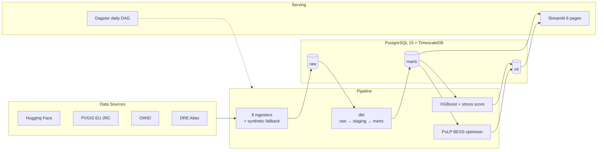

# Nigeria Grid & Mini-Grid Intelligence Platform

End-to-end data platform that ingests Nigerian grid, demand, outage, solar, and settlement data, then applies machine learning and linear optimisation to predict grid instability, optimise battery dispatch, and score settlements for solar mini-grid deployment.

[](https://www.python.org/downloads/)
[](https://www.timescale.com/)
[](https://www.getdbt.com/)
[](https://dagster.io/)
[](https://www.docker.com/)
[](https://aws.amazon.com/ec2/)

**Live demo:** [http://51.21.191.10:8501](http://51.21.191.10:8501) — deployed on AWS EC2 (t3.micro, eu-north-1)

---

## The Problem

Nigeria's installed generation capacity exceeds 13,000 MW, but delivered supply often sits near 4,000 MW. The gap is not generation. It is the absence of an intelligence layer that coordinates generation, storage, demand, and grid stability across the country.

This project is a working prototype of that layer.

---

## What the Platform Does

| Layer | Capability |
|---|---|
| Ingests | 8 real data sources, 944,481 records (grid, demand, telemetry, outages, solar, settlements) |
| Transforms | 16 dbt models (8 staging, 3 intermediate, 6 marts), 27 schema tests |
| Predicts | 2 XGBoost models + composite 0 to 100 grid stress score across 23 substations |
| Optimises | PuLP 4.0 linear programming for BESS dispatch, 3 regions × 4 deployment modes |
| Scores | 154,319 Nigerian settlements for solar mini-grid viability |
| Serves | 6-page Streamlit dashboard + Dagster orchestration in Docker Compose |

---

## Architecture



---

## Key Findings

**Grid stability.** Real Nigerian grid data shows outages in 26% of hours. Severe outages (>1,000 customers affected) occur in 3.5% of hours. The composite stress score successfully flags substations under sustained load.

**Battery economics.** Grid + diesel + battery saves 1.3% to 6.2% of daily operating cost per region. Solar charging delivers 2 to 3 times the savings of grid charging. Battery-only, battery-grid-only, and battery-diesel-only configurations are physically or economically infeasible. Batteries pay off only when grid and diesel coexist as complementary sources.

**Solar mini-grid viability.** 30,913 settlements (top 20%) are deployment-ready, covering roughly 35 million residents. Kano leads with 4,668 viable sites, followed by Katsina at 4,437 and Kaduna at 2,832. Serving all viable sites would require approximately 15 GW of solar and 60 GWh of storage.

**Commercial viability.** Diesel cost rose 86% year on year from 2025 to 2026. Solar LCOE held steady at N90 to N120 per kWh. Battery IRR potential sits at 16% to 22% at current market prices. The renewable case strengthens each year as diesel prices rise faster than solar costs.

---

## Data Sources

| Source | Rows | Type |
|---|---|---|
| Hugging Face `electricsheepafrica` (5 datasets) | 790,000 | Real HF snapshots |
| EU JRC PVGIS | 36 | Real API |
| Our World in Data | 126 | Real CSV |
| World Bank DRE Atlas | 154,319 | Real GeoParquet |

Every ingester has a synthetic fallback for source failures. See [docs/architecture.md](docs/architecture.md) for the full reliability strategy.

---

## Tech Stack

| Category | Tools |
|---|---|
| Language | Python 3.12, SQL |
| Orchestration | Dagster 1.13 |
| Transformation | dbt-core 1.11 + dbt-postgres |
| Storage | PostgreSQL 15 + TimescaleDB |
| ML | XGBoost, scikit-learn, pandas, numpy |
| Optimisation | PuLP 4.0 + CBC solver |
| Visualisation | Streamlit, Plotly |
| Containerisation | Docker, Docker Compose |
| Cloud Deployment | AWS EC2 (t3.micro, eu-north-1) |
| CI | GitHub Actions (ruff, mypy, pytest) |

---

## Quick Start

Run the full stack locally:

```bash
git clone https://github.com/Joystyxx/nigeria-grid-intelligence.git
cd nigeria-grid-intelligence
cp .env.example .env
docker compose up --build -d
docker compose ps
```

Once running:

- **Streamlit dashboard** at http://localhost:8501
- **Dagster orchestration** at http://localhost:3000
- **PostgreSQL** at localhost:5432

---

## Deployment

The dashboard is deployed on **AWS EC2** (t3.micro, eu-north-1) using a reduced Compose file (`docker-compose.prod.yml`) that runs only PostgreSQL and Streamlit. Dagster stays local for development — it is intentionally not exposed publicly, since the open-source Dagster webserver has no built-in authentication.

Deployment steps:

1. Provision an Ubuntu/Debian-free Amazon Linux 2023 instance with Docker and Docker Compose
2. Clone the repository and configure `.env`
3. Build and start the production stack: `docker compose -f docker-compose.prod.yml up -d`
4. Restore the seeded database dump into the containerized PostgreSQL
5. Open port 8501 to the public internet via the EC2 security group

To reproduce the full pipeline (including Dagster), run `docker compose up` locally.

---

## Project Structure

```
nigeria-grid-intelligence/
├── app/                  Streamlit dashboard (6 pages)
├── config/               Energy prices YAML
├── dags/                 Dagster DAG (15 assets)
├── dbt/                  16 models (staging, intermediate, marts)
├── docs/                 Architecture, data dictionary, GeoJSON exports
├── scripts/              Utility scripts
├── src/grid_intelligence/
│   ├── ingestion/        8 ingesters + synthetic fallback
│   ├── ml/               Features, training, prediction, stress scoring
│   └── optimization/     BESS dispatch, sensitivity, multi-year analysis
├── tests/                pytest suite
├── docker-compose.yml          Full local stack (Postgres + Dagster + Streamlit)
├── docker-compose.prod.yml     Lightweight EC2 deployment (Postgres + Streamlit)
└── pyproject.toml
```

---

## Documentation

- [Architecture](docs/architecture.md) — design decisions, reliability strategy, extensions
- [Data Dictionary](docs/data_dictionary.md) — every table and column explained
- [Full viability map (GeoJSON)](docs/minigrid_viability_full.geojson) — 30,913 settlements

---

## Limitations

The platform uses the best publicly available Nigerian energy data, and that data is inadequate: no real-time SCADA feeds, no settlement-level consumption metering, and no machine-readable tariff feeds. These constraints bound how far the findings can be trusted without better upstream data. Full discussion in [docs/architecture.md](docs/architecture.md).

---

## Testing

```bash
pytest tests/                       # all 13 tests (needs Postgres running)
pytest tests/ -m "not requires_db"  # CI subset (no DB needed)
```

CI runs ruff, mypy, and pytest on every push via GitHub Actions.

---

## License

MIT.

---

## Contact

**Olawale Afolayan** , Lagos
[GitHub @Joystyxx](https://github.com/Joystyxx) · [Repository](https://github.com/Joystyxx/nigeria-grid-intelligence) · [Live Demo](http://51.21.191.10:8501)